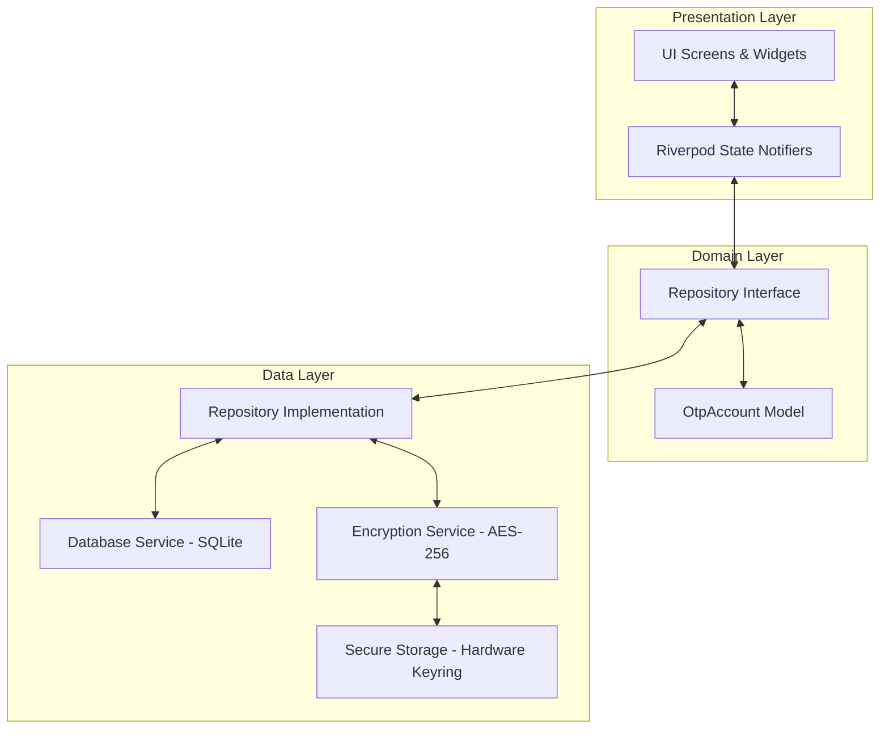
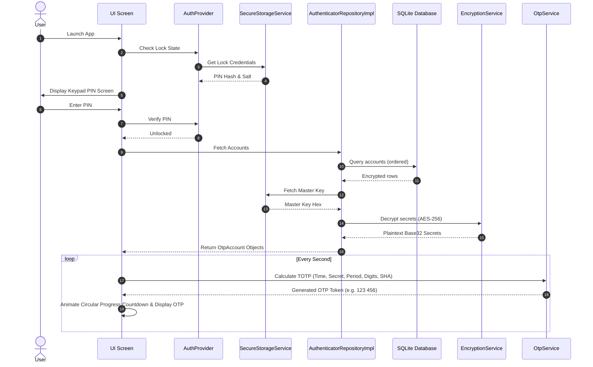
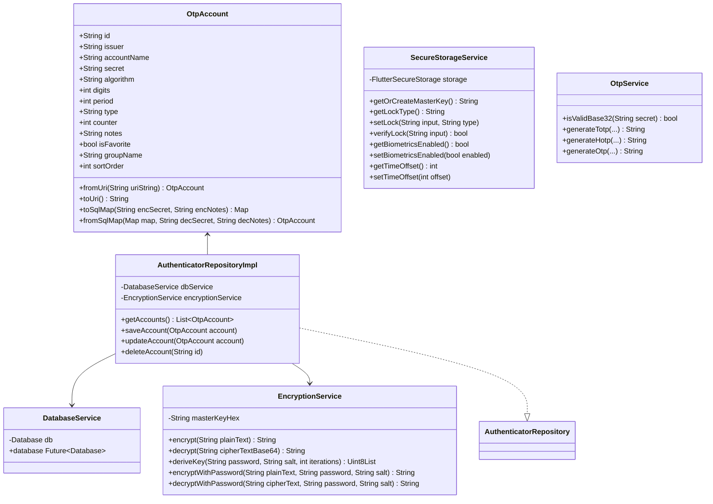
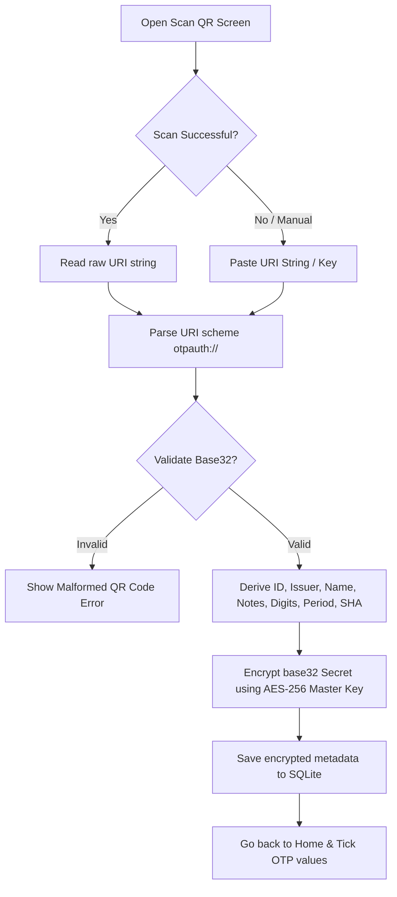

# Digo Authenticator App

An enterprise-grade, production-ready, fully offline Multi-Factor Authentication (MFA) application built using Flutter. This app works 100% locally on the device and is compatible with official MFA standards used by Google, Microsoft, GitHub, AWS, and other major services.

## Features

- **Standard OTP Protocols**: Completely supports RFC 6238 (TOTP) and RFC 4226 (HOTP).
- **Multiple Cryptographic Algorithms**: Supports HMAC-SHA1, HMAC-SHA256, and HMAC-SHA512.
- **Custom configurations**: Supports 6 and 8 digits, custom periods (15, 30, and 60 seconds), and HOTP manual counters.
- **Security Features**:
  - Hardware-backed, platform-native encryption secrets (AES-256).
  - Secure local database storage utilizing SQLite.
  - App Lock using biometric credentials (fingerprint, Face ID) or PIN lock.
  - Automatic lock timing after inactivity.
  - Block screenshots and hide previews in recent applications.
- **Backup & Restore**:
  - Secure, password-protected JSON backup/restore.
  - PBKDF2 (HMAC-SHA256 based 2048 iterations) key derivation stretching with a cryptographically secure random salt (16-byte).
- **Material 3 UI**: Clean, Google Authenticator-inspired dashboard, custom circular countdown clocks, light/dark modes, Hindi/English translations, and reordering.

---

## Diagrams

### 1. Architecture Diagram (Clean Architecture & MVVM)

The application follows clean architectural boundaries: **Presentation**, **Domain**, and **Data** layers, using Riverpod for state management, GetIt for Dependency Injection, and a hardware-backed Cryptography Layer.



### 2. Sequence Diagram (Unlocking and Displaying TOTPs)



### 3. Class Diagram (Core Components)



### 4. Flow Diagram (Adding Account via QR Scan)



---

## Installation & Build Instructions

### Prerequisites
- Flutter SDK (version 3.12.2 or higher)
- Android Studio / Xcode (for mobile deployments)
- Visual Studio / CMake (for Windows builds)
- Git

### Initial Setup
1. Clone the project:
   ```bash
   git clone <repo-url>
   cd digo_authenticator_app
   ```
2. Retrieve packages:
   ```bash
   flutter pub get
   ```

### Running the App Locally
```bash
# Run on connected device (Android, iOS, Desktop)
flutter run
```

---

## Build Instructions

### Android Build (Build APK)
1. Ensure the keystore is configured in `android/key.properties` for production releases.
2. Run the build command:
   ```bash
   flutter build apk --release
   ```
3. The generated release APK will be located under:
   `build/app/outputs/flutter-apk/app-release.apk`

### Windows Build (Build EXE)
1. Ensure Visual Studio with "Desktop development with C++" workload is installed.
2. Run the build command:
   ```bash
   flutter build windows --release
   ```
3. The generated release executable and dependencies will be located under:
   `build/windows/runner/Release/`

---

## Future Improvements

1. **Google Drive Sync (Optional/Initiated)**: Integrate custom Google Drive backup storage using encrypted upload flows, preserving absolute offline security unless manually synchronized.
2. **YubiKey / Security Key support**: Implement FIDO2/WebAuthn NFC integrations to unlock the vault.
3. **Advanced Icons matching**: Dynamically map issuer strings to SVG icons locally (e.g. Google, Discord, AWS icons pre-loaded in app assets) without requesting external CDN links to preserve 100% user privacy.
4. **Root & Jailbreak Detection**: Add native plugins like `flutter_jailbreak_detection` to warning blocks if operating on compromised OS architectures.
